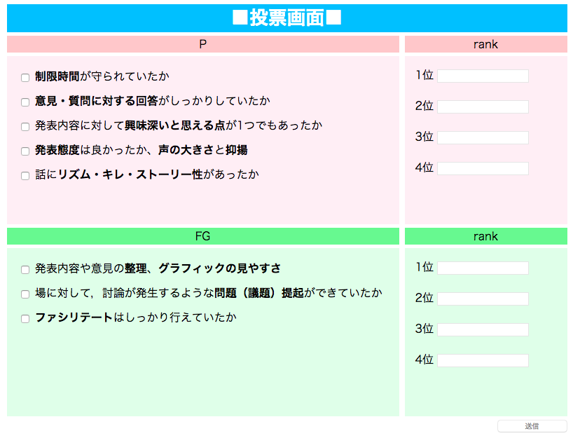
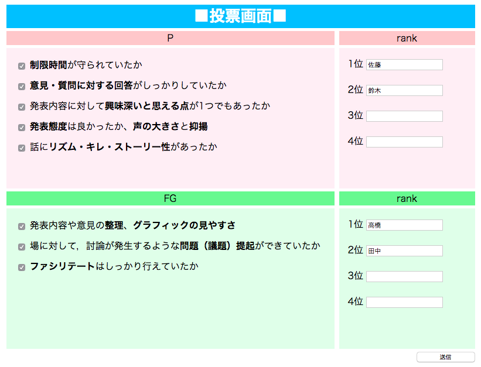

# voting_system

## 概要
　研究室のゼミの時間に使用する投票システムを友人と制作しています。制作途中のため未完成の状態での提出となってしまい大変申し訳ありませんが、
 ポートフォリオとして提出させていただきます。

## 使用方法
　画面構成としては左側に投票時に気をつけるべきチェック項目、右側に投票したい人物の名前を入力するフォームで構成されています。最初の状態では入力フォーム
に名前を入力することができない状態となっています。左側のチェック項目を読み、全てのチェックボックスにチェックを入れて初めて名前を入力できるように
なります。これは全員が同じような評価基準を持った状態で投票してもらうためにこのような仕様にしました。

　全員の発表を聞いたあと、フォームに名前を入力して1位から順にP(発表者)とFG(ファシリテーション/グラフィック担当者)にそれぞれ投票します。
 発表日により発表人数が異なるため、フォームに入力しなければいけない人数は設定で変更できるようにしています。現在の設定ではそれぞれ
 2人ずつ投票する必要があります。予め登録された名前以外の名前を入力すると
入力フォームが赤く変化します(登録した名前を佐藤、鈴木、高橋、田中、渡辺、伊藤、山本、中村とポートフォリオ用に一部変更しています)。

　指定された人数だけ入力が完了すると画面下部の投票ボタンが押せるようになります。投票ボタンは全てのチェックボックスにチェックを入れている、
指定人数だけ名前を入力している、入力された名前が全て登録されているものである時のみ押せるようになっています。
投票ボタンを押すと投票結果画面に遷移します。現時点ではまだ投票画面は完成していないため、仮の画面が表示されるようになっています。

    
